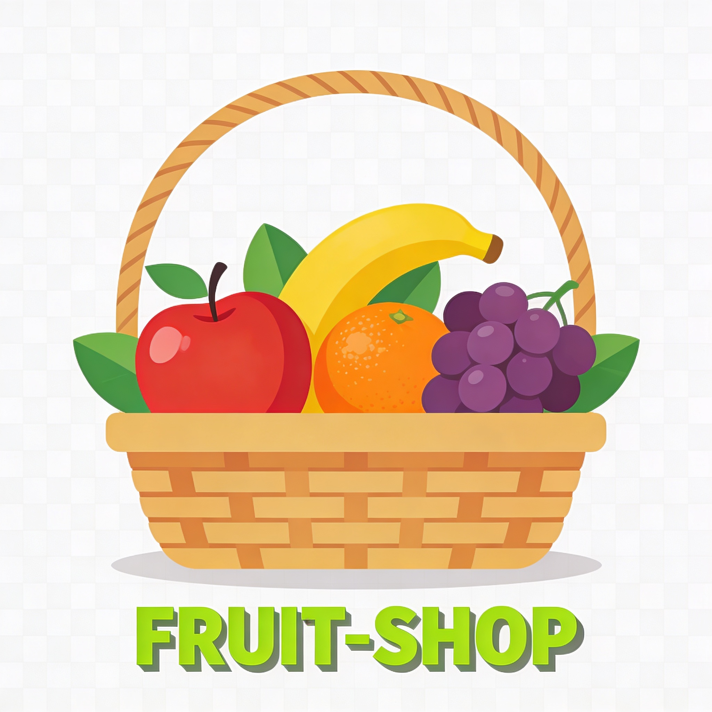

# 🍏 Fruit-Shop - Tienda Online de Frutas (PHP)

Página web dinámica para una frutería online. Gestiona catálogo de frutas, carrito de compra, pedidos y admin con PHP backend.

## ✨ Características
- **Catálogo Interactivo**: Productos con fotos, precios, stock.
- **Carrito y Pedidos**: Añadir items, checkout, guardar en BD.
- **Panel Admin**: CRUD frutas/pedidos (añadir, editar, eliminar).
- **Responsive**: Bootstrap para móvil/desktop.
- **Base de Datos**: MySQL para productos/usuarios.
- **Seguridad**: Validaciones PHP, sesiones.
- **Frontend**: HTML/CSS/JS vanilla y jQuery.

## 🚀 Instalación Local
1. Clona: `git clone https://github.com/twelfetitan/Fruit-Shop.git`
2. **XAMPP/WAMP**: Inicia Apache + MySQL.
3. Importa `db/fruit_shop.sql` a phpMyAdmin.
4. Configura `includes/config.php` (host, user, pass).
5. Abre `localhost/Fruit-Shop/`.
6. Admin: `localhost/Fruit-Shop/admin/` (user: admin/pass:123).

## 🛠️ Tecnologías
- PHP 8+
- MySQL
- HTML5/CSS3/JS

---

ℹ️ **Proyecto Académico DAM**  
Ejercicio de aprendizaje web PHP. No comercial.

  

